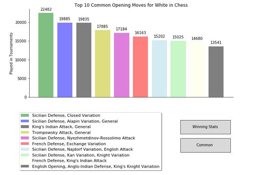

# Opening-Chess-Moves
Uses Pandas and Matplotlib to create an interactive visual about the opening moves in chess from two separate data sources. The full code can be seen in the "Chess.ipynb" file

